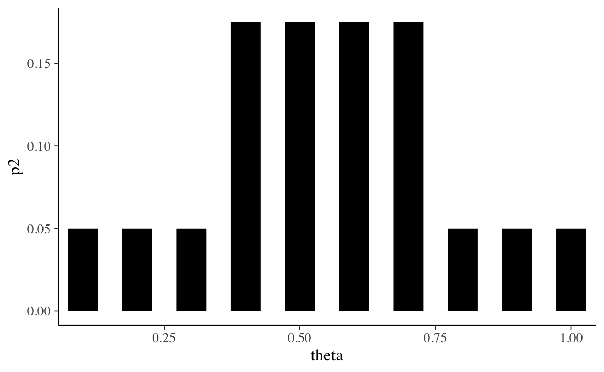
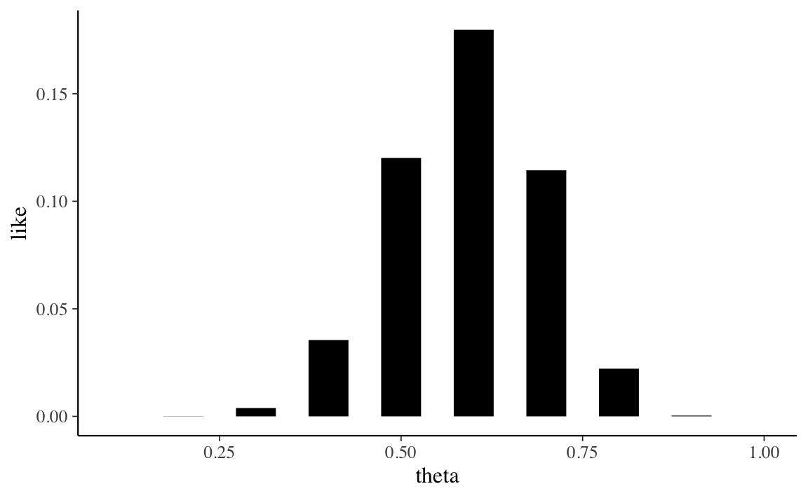
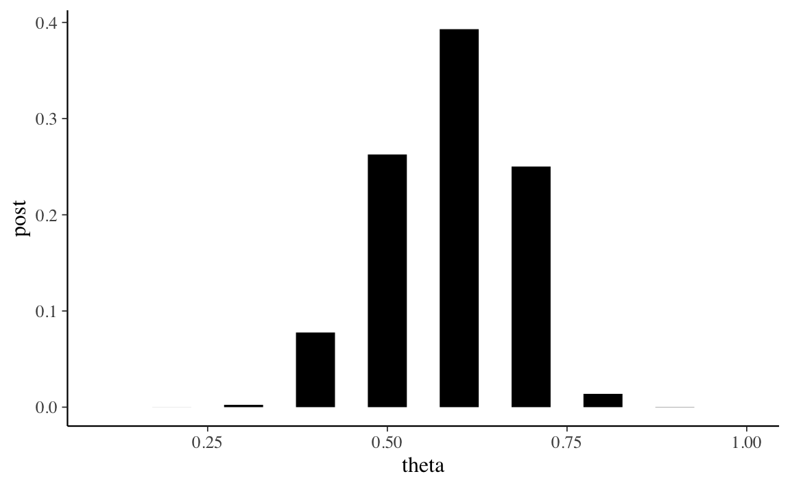

# Pensare ad una proporzione in termini soggettivi {#ch-subj-think-prop}


Obiettivo di questo Capitolo è introdurre l'inferenza bayesiana considerando il caso della verosimiglianza binomiale. Esamineremo prima il caso di una distribuzione a priori è discreta; poi considereremo una distribuzione a priori continua. Il materiale qui presentato segue molto da vicino il capitolo 7 del testo di @albert2019probability.

## Inferenza bayesiana con una distribuzione a priori discreta {#ch-prior-discr-binom}

Nei problemi tradizionali di teoria delle probabilità ci sono molti esempi che riguardano l'estrazione di palline colorate da un'urna. In questi esempi, ci viene fornito il numero di palline di vari colori presenti nell'urna e ci viene chiesto di calcolare le probabilità di vari eventi. Ad esempio, in un'urna ci sono 40 palline bianche e 20 rosse. Se estrai due palline a caso, qual è la probabilità che entrambe siano bianche? 

L'approccio bayesiano considera uno scenario diverso, ovvero quello in cui non conosciamo le proporzioni delle palline colorate presenti nell'urna. Cioè, nell'esempio precedente, sappiamo solo che nell'urna ci sono due tipi di palline colorate, ma non sappiamo che 40 sono bianche (proporzione di bianco = $2/3$) e 20 sono rosse (proporzione di rosso = $1/3$). Ci poniamo la seguente domanda: è possibile inferire le proporzioni di palline nell'urna estraendo un campione di palline dall'urna e osservando i colori delle palline nel campione? Espresso in questo modo, questo diventa un problema di inferenza statistica, perché stiamo cercando di inferire la proporzione $\theta$ della popolazione sulla base di un campione casuale. Per continuare con l'esempio precedente, quello che vogliamo fare è inferire $\theta$, la proporzione di palline rosse nell'urna, in base al numero di palline rosse e bianche che osserviamo nel campione.

Le proporzioni assomigliano alle probabilità. Ricordiamo che sono state proposte tre diverse interpretazioni del concetto di una probabilità. 

- Il punto di vista classico: è necessario enumerare tutti gli eventi elementari dello spazio campionario in cui ogni risultato è ugualmente probabile.
- Il punto di vista frequentista: è necessario ripetere l'esperimento esperimento casuale (cioè l'estrazione del campione) molte volte in condizioni identiche.
- La visione soggettiva: è necessario esprimere la propria opinione sulla probabilità di un evento unico e irripetibile.

La visione classica non sembra potere funzionare qui, perché sappiamo solo che ci sono due tipi di palline colorate e il numero totale di palline è 60. Anche se estraiamo un campione di 10 palline, possiamo solo osservare la proporzione di palline rosse palline nel campione. Non c'è modo per stabilire quali sono le proprietà dello spazio campionario in cui ogni risultato è ugualmente probabile.

La visione frequentista potrebbe funzionare nel caso presente. Possiamo considerare il processo del campionamento (cioè l'estrazione di un campione casuale di 10 palline dall'urna) come un esperimento casuale che produce una proporzione campionaria $p$. Potremmo quindi pensare di ripetere l'esperimento molte volte nelle stesse condizioni, ottenere molte proporzioni campionarie $p$ e riassumere poi in qualche modo questa distribuzione di statistiche campionarie. Ripetendo l'esperimento casuale tante volte è possibile ottenere una stima abbastanza accurata della proporzione $\theta$ di palline rosse nell'urna. Questo processo è fattibile, ma è però noioso, dispendioso in termini di tempo e soggetto ad errori.

La visione soggettivista concepisce invece la probabilità sconosciuta $\theta$ come un'opinione soggettiva di cui possiamo essere più o meno sicuri. Abbiamo visto in precedenza come questa opinione soggettiva dipenda da due tipi di evidenze: le nostre credenze iniziali e le nuove informazioni fornite dai dati che abbiamo osservato. Vedremo in questo capitolo come sia possibile combinare le credenze iniziali rispetto al possibile valore $\theta$ con le evidenza fornite dai dati per giungere ad una credenza a posteriori su $\theta$. In particolare, vedremo come si possa pensare in termini soggetti a delle quantità sconosciute (in questo caso, $\theta$) usando le distribuzioni di probabilità. 

Sappiamo che, essendo una proporzione, $\theta$ può assumere valori compresi tra 0 e 1. Potremmo pensare che $\theta$ sia uguale, ad esempio, a 0.5. Ciò significa assegnare all'evento $\theta = 1$ la probabilità 1 -- in altri termini, significa dire che siamo assolutamente certi che la quantità sconosciuta $\theta$ ha il valore di 0.5. Questa posizione, però, è troppo estrema: non possiamo essere assolutamente certi che una quantità sconosciuta abbia uno specifico valore; altrimenti non sarebbe una quantità sconosciuta. Invece, sembra più sensato pensare che $\theta$ può, in linea di principio, assumere valori diversi e, a questi valori, vengono attribuiti diversi livelli di certezza soggettiva. Consideriamo, ad esempio, 10 possibili valori per $\theta$: 


```r
theta = seq(0.1, 1, length.out = 10)
theta
#>  [1] 0.1 0.2 0.3 0.4 0.5 0.6 0.7 0.8 0.9 1.0
```

Se non abbiamo alcun motivo di pensare diversamente, potremmo pensare di assegnare a ciascuno di questi valori lo stesso livello di plausibilità:


```r
p1 <- rep(0.1, 10)
p1
#>  [1] 0.1 0.1 0.1 0.1 0.1 0.1 0.1 0.1 0.1 0.1
```


```r
tibble(theta, p1) %>% 
  ggplot(aes(theta, p1)) +
  geom_segment(
    aes(xend = theta, yend = 0), size = 10, lineend = "butt"
  )
```


Oppure, per qualche ragione, potremmo pensare che i valori centrali della distribuzione di $\theta$ siamo più plausibili dei valori estremi. Tale opinione soggettiva potrebbe corrispondere alla seguente distribuzione di massa di probabilità:


```r
p2 <- c(
  0.05, 0.05, 0.05, 0.175, 0.175, 0.175, 0.175, 0.05, 0.05, 0.05
)
p2
#>  [1] 0.050 0.050 0.050 0.175 0.175 0.175 0.175 0.050 0.050 0.050
```


```r
tibble(theta, p2) %>% 
  ggplot(aes(theta, p2)) +
  geom_segment(
    aes(xend = theta, yend = 0), size = 10, lineend = "butt"
  )
```



La prima distribuzione di probabilità è chiamata distribuzione discreta uniforme perché attribuisce la stessa probabilità (ovvero, 1/10) ad ogni elemento dell'insieme discreto su cui è definita (ovvero, $0.1, 0.2, \dots, 1.0$). Anche la seconda distribuzione è discreta, ma non è uniforme: viene ritenuto più plausibile che $\theta$ assuma un valore nell'insieme $\{0.4, 0.5, 0.6, 0.7\}$ piuttosto che nell'insieme  $\{0.1, 0.2, 0.3, 0.8, 0.9, 1.0\}$.

Le credenze relative alla plausibilità dei possibili valori che $\theta$ possono assumere forme diverse e corrispondono a quella che viene chiamata la _distribuzione a priori_, ovvero descrivono le credenze che possediamo relativamente alla quantità sconosciuta di interesse. 

La procedura di inferenza bayesiana non fa altro che "aggiornare" tali credenze a priori utilizzando le informazioni fornite da un campione di dati. Usando il teorema di Bayes, le informazioni dei dati vengono combinate con le nostre precedenti credenze relative alla quantità sconosciuta $\theta$ per giungere ad una credenza detta "a posteriori". 

Supponendo che i dati corrispondano all'osservazione di 12 palline rosse in 20 estrazioni con rimessa dall'urna, usiamo ora la seconda delle distribuzioni a priori descritte in precedenza per ottenere la distribuzione a posteriori. Il teorema di Bayes specifica la distribuzione a posteriori come il prodotto della verosimiglianza e la distribuzione a priori, diviso per una costante di normalizzazione:

$$
p(\theta \mid y) = \frac{p(y \mid \theta)p(\theta)}{p(y)}.
$$

Per definire la funzione di verosimiglianza, $p(y \mid \theta)$, è necessario pensare a come abbiamo ottenuto i dati. Abbiamo estratto 20 palline dall'una, con rimessa. Dunque, se l'estrazione è stata casuale con reinserimento, allora i dati (12 successi in 20 prove) possono essere intesi come il risultato di un esperimento casuale binomiale. Usando $\textsf{R}$, la funzione di verosimiglianza è dunque data da:


```r
like <- dbinom(12, 20, theta)
like
#>  [1] 5.422595e-08 8.656592e-05 3.859282e-03 3.549744e-02 1.201344e-01
#>  [6] 1.797058e-01 1.143967e-01 2.216088e-02 3.557765e-04 0.000000e+00
```


```r
tibble(theta, like) %>% 
  ggplot(aes(theta, like)) +
  geom_segment(
    aes(xend = theta, yend = 0), size = 10, lineend = "butt"
  )
```



Per calcolare la distribuzione a posteriori dobbiamo dunque fare il prodotto (elemento per elemento) del vettore che contiene i valori della distribuzione a priori per il vettore che contiene i valori di verosimiglianza. Tale prodotto andrà poi diviso per una costante di normalizzazione, $p(y)$. 

Per la legge della probabilità totale, il denominatore corrisponde alla probabilità marginale dei dati $y$ ed è uguale alla somma dei prodotti tra la distribuzione a priori e la verosimiglianza calcolata in corrispondenza di ciascun valore possibile di $\theta$. 
Nel nostro caso discreto, la probabilità marginale dei dati ci calcola utilizzando la distribuzione a priori


```r
p2
#>  [1] 0.050 0.050 0.050 0.175 0.175 0.175 0.175 0.050 0.050 0.050
```

e la verosimiglianza 


```r
like
#>  [1] 5.422595e-08 8.656592e-05 3.859282e-03 3.549744e-02 1.201344e-01
#>  [6] 1.797058e-01 1.143967e-01 2.216088e-02 3.557765e-04 0.000000e+00
```

Dopo avere fatto il prodotto 


```r
p2 * like
#>  [1] 2.711298e-09 4.328296e-06 1.929641e-04 6.212052e-03 2.102351e-02
#>  [6] 3.144851e-02 2.001943e-02 1.108044e-03 1.778882e-05 0.000000e+00
```

dobbiamo sommare:


```r
sum(p2 * like)
#> [1] 0.08002663
```

Una volta calcolata la verosimiglianza marginale dei dati, possiamo trovare la distribuzione a posteriori di $\theta$:


```r
post <- (p2 * like) / sum(p2 * like)
post
#>  [1] 3.387994e-08 5.408570e-05 2.411248e-03 7.762481e-02 2.627064e-01
#>  [6] 3.929756e-01 2.501596e-01 1.384594e-02 2.222863e-04 0.000000e+00
```


```r
tibble(theta, post) %>% 
  ggplot(aes(theta, post)) +
  geom_segment(
    aes(xend = theta, yend = 0), size = 10, lineend = "butt"
  )
```



Conoscendo la distribuzione a posteriori di $\theta$ diventa possibile calcolare altre quantità di interesse. Per esempio, la moda a posteriori di $\theta$ si ricava direttamente dal grafico precedente, e corrisponde a 0.6. La media a posteriori è data da:


```r
sum(pi * post)
#> [1] 3.141593
```

La varianza della distribuzione a posteriori è


```r
sum(theta^2 * post) - (sum(theta * post))^2
#> [1] 0.008817409
```

Il calcolo della distribuzione a posteriori, nel caso di una distribuzione a priori discreta, è implementata nella funzione `bayesian_crank()` del pacchetto `ProbBayes`. Dato che `ProbBayes` non è su CRAN, può essere installato nel modo seguente:


```r
library("devtools")
install_github("bayesball/ProbBayes")
```

Una volta installato, il pacchetto può essere caricato come facciamo normalmente:


```r
library("ProbBayes")
```

Per usare `bayesian_crank()` procediamo come indicato di seguito:


```r
df <- tibble(p = theta, Prior = p2)
y <- 12
n <- 20
df$Likelihood <- dbinom(y, prob = df$p, size = n)
df <- bayesian_crank(df)
df
#> # A tibble: 10 × 5
#>       p Prior   Likelihood       Product    Posterior
#>   <dbl> <dbl>        <dbl>         <dbl>        <dbl>
#> 1   0.1 0.05  0.0000000542 0.00000000271 0.0000000339
#> 2   0.2 0.05  0.0000866    0.00000433    0.0000541   
#> 3   0.3 0.05  0.00386      0.000193      0.00241     
#> 4   0.4 0.175 0.0355       0.00621       0.0776      
#> 5   0.5 0.175 0.120        0.0210        0.263       
#> 6   0.6 0.175 0.180        0.0314        0.393       
#> 7   0.7 0.175 0.114        0.0200        0.250       
#> 8   0.8 0.05  0.0222       0.00111       0.0138      
#> # … with 2 more rows
```

Verifichiamo il risultato trovato calcolando, ad esempio, la media a posteriori (come abbiamo fatto sopra):


```r
sum(pi * df$Posterior)
#> [1] 3.141593
```

In questo modo possiamo dunque trovare la distribuzione a posteriori per $\theta$, nel caso di qualunque distribuzione a priori discreta.


## Inferenza bayesiana con una distribuzione a priori continua {#ch-prior-cont-binom}

Il caso di una distribuzione a priori discreta è stato discusso solo per scopi didattici. In generale, però, l'uso di una distribuzione a priori discreta non è una buona scelta per rappresentare le nostre credenze a priori sul parametro sconosciuto. Infatti, per definizione, una distribuzione a priori discreta può rappresentare solo alcuni dei possibili valori del parametro -- nel caso dell'esempio precedente, non abbiamo considerato il valore 0.55, per esempio. Sembra molto più sensato descrivere le nostre credenze a priori sul parametro utilizzando una distribuzione continua. 

Cerchiamo una funzione di densità con supporto in $[0, 1]$. Il candidato naturale è ovviamente fornito dalla funzione Beta (si veda il Capitolo \@ref(distr-rv-cont)). Come per le altre funzioni di densità, abbiamo a disposizione quattro funzioni $\textsf{r}$ che ci consentono di manipolare facilmente questa densità.

- Ad esempio, possiao valutare la funzione di densità $\mbox{Beta}(1, 1)$ in corrispondenza dei valori $p = 0.5$ e $p = 0.8$, che dovrebbe essere entrambi uguali a 1, e in corrispondenza di $p = 1.2$, che dovrebbe essere ugualea 0 poiché questo valore è al di fuori dell'intervallo $[ 0, 1]$.


```r
dbeta(c(0.5, 0.8, 1.2), 1, 1)
#> [1] 1 1 0
```

Oppure possiamo valutare la funzione distribuzione $\mbox{Beta}(1, 1)$ in corrispondenza dei punti 0.5 e 0.8:


```r
pbeta(c(0.5, 0.8), 1, 1)
#> [1] 0.5 0.8
```

Oppure possiamo calcolare la probabilità $P(0.5 < p < 0.8)$


```r
pbeta(0.8, 1, 1) - pbeta(0.5, 1, 1) 
#> [1] 0.3
```

Possiamo trovare i quntili della distribuzione $\mbox{Beta}(1, 1)$ di ordine 0.5 e 0.8:


```r
qbeta(c(0.5, 0.8), 1, 1)
#> [1] 0.5 0.8
```

Infine, è possibile simulare dei valori casuali dalla distribuzione $\mbox{Beta}(1, 1)$. Se vogliamo 5 valori, scriviamo:


```r
rbeta(5, 1, 1)
#> [1] 0.2523117 0.5492791 0.2174402 0.4063601 0.2128675
```

Se vogliamo 5 valori da una $\mbox{Beta}(2, 10)$, scriviamo:


```r
rbeta(5, 2, 10)
#> [1] 0.17364773 0.21332530 0.24430864 0.15817644 0.04897118
```

Il pacchetto `ProbBayes` offre la funzione `beta_area()` per visualizzare la probabilità di una distribuzione Beta in un certo intrvallo di valori. Per esempio, se vogliamo la probabilità dell'evento per cui la variabile casuale $p$ è contenuta nell'intervallo $[0.1, 0.3]$ nel caso di una $\mbox{Beta}(2, 10)$, scriviamo:


```r
beta_area(0.1, 0.3, c(2, 10))
```


### Quali parametri per la distribuzione Beta?

Se usiamo una distribuzione Beta per rappresentare le nostre credenze a priori sul parametro $\theta$ (probabilità di successo), allora dobbiamo porci il problema di scegliere i parametri che definiscono la distribuzione Beta che meglio rappresenta le nostre opinioni a priori. Il modo più ovvio per ottenere questo risultato è per prove ed errori. Oppure, possiamo individuare i parametri $\alpha$ e $\beta$ della distribuzione interpretando $\alpha$ come la nostra stima a priori del numero di "successi", $\beta$ come a nostra stima a priori del numero di "insuccessi" e $\alpha + \beta$ come il numero di prove del campione.  Quindi, per esempio, se pensiamo che, su 30 prove, verranno osservati 10 successi, otteniamo una $\mbox{Beta}(10, 20)$:


```r
bayesrules::plot_beta(10, 20, mean = TRUE, mode = TRUE)
```


In alternativa, potremmo specificare la distribuzione a priori definendo la mediana e un quantile della distribuzione. Per esempio, le nostre opinioni a priori sul parametro potrebbero essere tali per cui pensiamo che la mediana della distribuzione sia 0.25 e il quantile della distribuzione di ordine 0.9 sia 0.5. Usando la Shiny App `ProbBayes::ChooseBeta()` troviamo i parametri $\alpha = 1.84$ e $\beta = 4.89$.

## Commenti e considerazioni finali {-}

Abbiamo qui introdotto la procedura dell'aggiornamento bayesiano nel caso in cui la distribuzione a priori sia discreta. Abbiamo anche fornito alcune informazioni che sono utili per affrontare il problema nel caso in cui viene utilizzata una distribuzione a priori continua. Se viene utilizzata una distribuzione a priori continua, al denominatore del rapporto di Bayes troviamo un integrale che, in generale, non si può risolvere per via analitica. Il caso dell'inferenza di una proporzione, in cui la distribuzione a priori è una distribuzione Beta e la verosimiglianza è binoniale, rappresenta però un'eccezione, ovvero consente di derivare le proprietà della distribuzione a posteriori per via analitica. Il prossimo capitolo ha lo scopo di mostrare come questo possa essere fatto.
