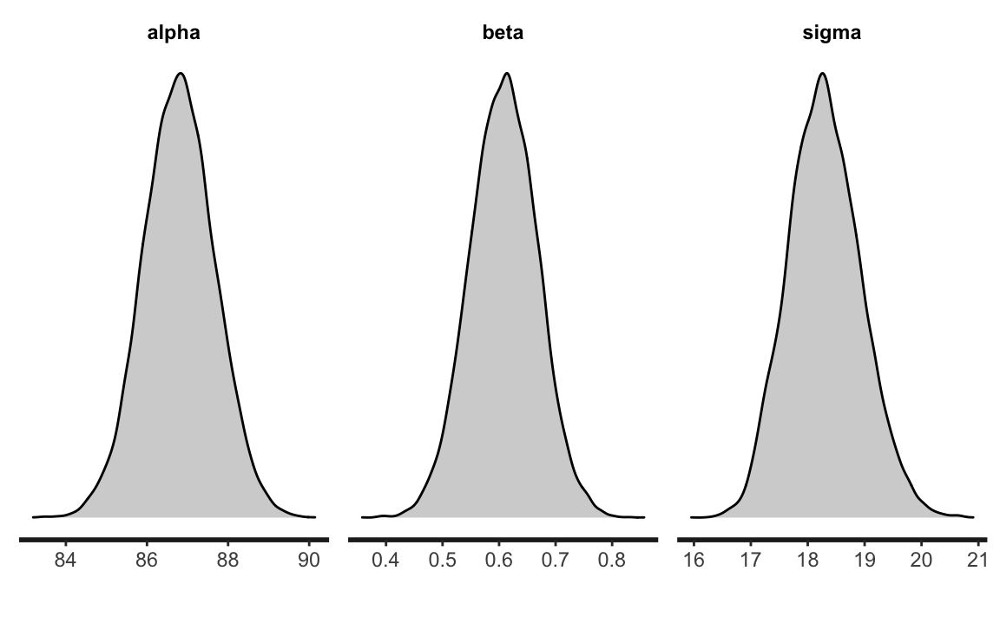

# Inferenza sul modello lineare {#inference-reg-lin-stan}


## Rappresentazione grafica dell'incertezza della stima

Un primo modo per rappresentare l'incertezza dell'inferenza in un ottica bayesiana è quella di rappresentare graficamente la retta specificata dal modello lineare. Continuando con l'esempio descritto nel Capitolo precedente (ovvero, i dati `kid_score` e i valori `mom_iq` centrati), usando la funzione `rstan::read_stan_csv` leggiamo i file CSV generati da `cmdstan` e trasformiamo le stime a posteriori dei parametri in formato `stanfit`:


```r
stanfit <- rstan::read_stan_csv(fit2$output_files())
posterior <- extract(stanfit)
```

Creiamo ora un diagramma a dispersione dei dati con sovrapposto il valore atteso della $y$:


```r
tibble(
  kid_score = df$kid_score,
  mom_iq = df$mom_iq - mean(df$mom_iq)
) %>%
  ggplot(aes(mom_iq, kid_score)) +
  geom_point() +
  geom_abline(
    intercept = mean(posterior$alpha),
    slope = mean(posterior$beta)
  )
```


L'incertezza della stima della retta specifiata dal modello lineare può essere visualizzata tracciando molteplici rette, ciascuna delle quali definita da un diverso valore estratto a caso dalla distribuzione a posteriori dei parametri $\alpha$ e $\beta$. Per ottenere questo risultato dobbiamo estrarre le informazioni richieste dall'oggetto `stanfit` che abbiamo creato; usiamo, per esempio, le funzionalità di `tidybayes`:


```r
tidybayes::get_variables(stanfit)
#>  [1] "alpha_std"     "beta_std"      "sigma_std"     "alpha"        
#>  [5] "beta"          "sigma"         "lp__"          "accept_stat__"
#>  [9] "treedepth__"   "stepsize__"    "divergent__"   "n_leapfrog__" 
#> [13] "energy__"
```

Creiamo un Dataframe in formato tidy (cioè, tale per cui le osservazioni stanno sulle righe e le variabili stanno sulle colonne) che contiene le stime a posteriori di $\alpha$ e $\beta$:


```r
draws <- stanfit %>%
  spread_draws(beta, alpha)
```


```r
draws %>%
  head(10)
#> # A tibble: 10 × 5
#>   .chain .iteration .draw  beta alpha
#>    <int>      <int> <int> <dbl> <dbl>
#> 1      1          1     1 0.632  88.4
#> 2      1          2     2 0.491  87.5
#> 3      1          3     3 0.717  85.9
#> 4      1          4     4 0.478  87.5
#> 5      1          5     5 0.610  86.4
#> 6      1          6     6 0.570  86.7
#> 7      1          7     7 0.623  87.0
#> 8      1          8     8 0.616  87.2
#> # … with 2 more rows
```

Possiamo ora generare un diagramma a dispersione con `ggplot()`:


```r
tibble(
  kid_score = df$kid_score,
  mom_iq = df$mom_iq - mean(df$mom_iq)
) %>%
  ggplot(aes(mom_iq, kid_score)) +
  geom_point() +
  geom_abline(
    data = draws, aes(intercept = alpha, slope = beta),
    size = 0.2, alpha = 0.01, color = "darkgray"
  ) +
  geom_abline(
    intercept = mean(posterior$alpha),
    slope = mean(posterior$beta)
  ) +
  labs(
    x = "Quoziente di intelligenza della madre",
    y = "Quoziente di intelligenza del bambino"
  )
```


Il grafico indica che le rette di regressione costruite estraendo a caso valori dalla distribuzione a posteriori dei parametri $\beta_0$ e $\beta_1$ tendono ad essere molto simili tra loro. Ciò significa che, relativamente alla dipendenza (lineare) del quoziente di intelligenza del bambino da quello della madra, la nostra incertezza è molto piccola.

## Intervalli di credibilità

L'incertezza inferenziale sui parametri può anche essere descritta mediante gli _intervalli di credibilità_, ovvero gli intervalli che contengono la quota desiderata (es., il 95%) della distribuzione a posteriori. Per l'esempio che stiamo discutendo, gli intervalli di credibilità al 95% si ottengono nel modo seguente:


```r
rstantools::posterior_interval(
  as.matrix(stanfit), 
  prob = 0.95
)
#>                    2.5%         97.5%
#> alpha_std   -0.08427372    0.08441589
#> beta_std     0.36136782    0.53165187
#> sigma_std    0.83902970    0.96033440
#> alpha       85.07713000   88.52020750
#> beta         0.49171840    0.72342520
#> sigma       17.12519250   19.60110750
#> lp__      -173.15907500 -168.54400000
```

Un grafico che, nel caso dei dati standardizzati, riporta l'intervallo di credibilità ai livelli di probabilità desiderati per i parametri $\alpha$, $\beta$ e $\sigma$ si ottiene con l'istruzione


```r
mcmc_areas(
  fit2$draws(c("alpha_std", "beta_std", "sigma_std")),
  prob = 0.8,
  prob_outer = 0.95
)
```


oppure nel modo nel modo seguente


```r
stanfit %>%
  mcmc_intervals(
    pars = c("alpha_std", "beta_std", "sigma_std"),
    prob = 0.8,
    prob_outer = 0.95
  )
```


### Quale soglia usare?

Non c'è niente di "magico" o necessario relativamente al livello di 0.95: il valore  0.95 è arbitrario. Sono possibili tantissime altre soglie per quantificare la nostra incertezza: alcuni ricercatori usano il livello di 0.89, altri quello di 0.5. Se l'obiettivo è quello di descrivere il livello della nostra incertezza relativamente alla stima del parametro, allora dobbiamo riconoscere che la nostra incertezza è descritta dall'*intera* distribuzione a posteriori. Per cui il metodo più semplice, più diretto e più completo per descrivere la nostra incertezza rispetto alla stima dei parametri è semplicemente quello di riportare graficamente _tutta_ la distribuzione a posteriori. Una rappresentazione della distribuzione a posteriori dei parametri del modello dell'esempio si ottiene nel modo seguente:


```r
rstan::stan_dens(
  stanfit,
  pars = c("alpha", "beta", "sigma"),
  fill = "lightgray"
)
```



## Test di ipotesi

È facile valutare ipotesi direzionali usando Stan. Per esempio, la probabilità  $Pr(\hat{\beta}_1 > 0)$ è


```r
sum(posterior$beta > 0) / length(posterior$beta)
#> [1] 1
```

ovvero, la probabilità $Pr(\hat{\beta}_1 < 0)$ è


```r
sum(posterior$beta < 0) / length(posterior$beta)
#> [1] 0
```

## Modello lineare robusto

Spesso i ricercatori devono affrontare il problema degli outlier: in presenza di outlier, un modello statistico basato sulla distribuzione gaussiana produrrà delle stime distorte dei parametri, ovvero stime che non si generalizzano ad altri campioni di dati. Il metodo tradizionale per affrontare questo problema è quello di eliminare gli outlier prima di eseguire l'analisi statistica. Il problema di questo approccio, però, è che il criterio utilizzato per eliminare gli outlier, quale esso sia, è arbitrario; dunque, usando criteri diversi per la rimozione di outlier, i ricercatori finiscono per trovare risultati diversi.

Questo problema trova una semplice soluzione nell'approccio bayesiano. Il modello lineare che abbiamo dicusso finora ipotizza una specifica distribuzione degli errori, ovvero $\varepsilon \sim \mathcal{N}(0, \sigma_{\varepsilon})$. In un modello formulato in questi termini, la presenza di solo un valore anomalo e influente ha un effetto drammatico sulle stime dei parametri. 

Per fare un esempio, introduciamo un singlo valore anomalo e influente nel set dei dati dell'esempio che stiamo discutendo:


```r
df2 <- df
df2$kid_score[434] <- -500
df2$mom_iq[434] <- 140
```

Per comodità, calcoliamo le stime di $\alpha$ e $\beta$ con il metodo dei minimi quadrati (tali stime sono simili a quelle che si otterrebbero con un modello bayesiano gaussiano che impiega distribuzioni a priori debolmente informative). Sappiamo che, nel campione originale di dati, $\hat{\beta} \approx 0.6$. In presenza di un solo outlier troviamo la stima di $\beta$ viene drammaticamente ridotta:


```r
lm(kid_score ~ mom_iq, data = df2) %>% 
  coef() 
#> (Intercept)      mom_iq 
#>   49.187954    0.362552
```

In generale, però, non è necessario assumere $\varepsilon \sim \mathcal{N}(0, \sigma_{\varepsilon})$. È altrettanto valido un modello che ipotizza una diversa distribuzione di densità per gli errori come, ad esempio, la distribuzione $t$ di Student con un piccolo numero di gradi di libertà. Una caratteristica della $t$ di Student è che le code della distribuzione contengono una massa di probabilità maggiore della distribuzione gaussiana. Ciò fornisce alla $t$ di Student la possibilità di "rendere conto" della presenza di osservazioni lontane dalla media della distribuzione. In altri termini, se in modello lineare usiamo la $t$ di Student quale distribuzione degli errori, la presenza di outlier avrà una minore influenza sulle stime dei parametri di quanto avvenga nel tradizionale modello lineare gaussiano.

Per verificare questa affermazione, modifichiamo il codice Stan usato in precedenza in modo tale da ipotizzare che $y$ segua una distribuzione $t$ di Student con un numero $\nu$ gradi di libertà stimato dal modello: `student_t(nu, mu, sigma)`.^[È equivalente scrivere $y_i = \mu_i + \varepsilon_i$, dove $\mu_i = \alpha + \beta x_i, \varepsilon_i \sim \mathcal{N}(0, \sigma_\varepsilon),$ oppure $y_i \sim \mathcal{N}(\mu_i, \sigma_\varepsilon).$]


```r
modelString <- "
data {
  int<lower=0> N;
  vector[N] y;
  vector[N] x;
}
transformed data {
  vector[N] x_std;
  vector[N] y_std;
  x_std = (x - mean(x)) / sd(x);
  y_std = (y - mean(y)) / sd(y);
}
parameters {
  real alpha_std;
  real beta_std;
  real<lower=0> sigma_std;
  real<lower=1> nu;    // degrees of freedom is constrained >1
}
model {
  alpha_std ~ normal(0, 1);
  beta_std ~ normal(0, 1);
  sigma_std ~ normal(0, 1);
  nu ~ gamma(2, 0.1);   // Juárez and Steel(2010)
  y_std ~ student_t(nu, alpha_std + beta_std * x_std, sigma_std);
}
generated quantities {
  real alpha;
  real beta;
  real<lower=0> sigma;
  alpha = sd(y) * (alpha_std - beta_std * mean(x) / sd(x))
           + mean(y);
  beta = beta_std * sd(y) / sd(x);
  sigma = sd(y) * sigma_std;
}
"
writeLines(modelString, con = "code/simpleregstdrobust.stan")
```

Costruiamo la lista dei dati usando il data.frame `df2` che include l'outlier:


```r
data3_list <- list(
  N = length(df2$kid_score),
  y = df2$kid_score,
  x = df2$mom_iq - mean(df2$mom_iq)
)
```

Adattiamo il modello lineare robusto ai dati:


```r
file <- file.path("code", "simpleregstdrobust.stan")
mod <- cmdstan_model(file)

fit4 <- mod$sample(
  data = data3_list,
  iter_sampling = 4000L,
  iter_warmup = 2000L,
  seed = SEED,
  chains = 4L,
  parallel_chains = 2L,
  refresh = 0,
  thin = 1
)
```

Se esaminiamo le stime dei parametri notiamo che la stima di $\beta$ non è stata influenzata dalla presenza di un'osservazione anomala e influente:


```r
fit4$summary(c("alpha", "beta", "sigma", "nu"))
#> # A tibble: 4 × 10
#>   variable   mean median     sd    mad     q5    q95  rhat ess_bulk ess_tail
#>   <chr>     <dbl>  <dbl>  <dbl>  <dbl>  <dbl>  <dbl> <dbl>    <dbl>    <dbl>
#> 1 alpha    87.8   87.8   0.901  0.898  86.3   89.3    1.00   14740.   12422.
#> 2 beta      0.602  0.602 0.0589 0.0587  0.505  0.699  1.00   14903.   11582.
#> 3 sigma    15.9   15.9   0.800  0.803  14.6   17.2    1.00   12993.   11619.
#> 4 nu        5.58   5.46  1.15   1.09    3.93   7.64   1.00   12998.   11288.
```

Il modello lineare robusto non risente dunque della presenza di outlier.

## Commenti e considerazioni finali {-}

Nell'approccio bayesiano possiamo rappresentare l'incertezza delle nostre credenze a posteriori in due modi: mediante la rappresentazione grafica dell'intera distribuzione a posteriori dei parametri o mediante l'uso degli intervalli di credibilità. Un bonus della discussione del presente Capitolo è quello di mostrare come il modello lineare tradizionale (che assume $\varepsilon \sim \mathcal{N}(0, \sigma_{\varepsilon})$) possa essere facilmente esteso nei termini di un modello robusto che offre una semplice soluzione al problema di ridurre l'effetto della presenza di osservazioni outlier.
